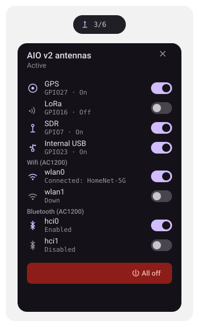

# AIO Antenna Control

A [DankMaterialShell](https://github.com/AvengeMedia/DankMaterialShell) bar
plugin for the ClockworkPi uConsole running with a
[Hackergadgets AIO v2](https://hackergadgets.com/products/uconsole-aio-v2)
expansion board. Adds a DankBar pill with a popout to enable/disable the
board's GPS, LoRa, SDR, and internal-USB power rails, the wifi and Bluetooth
radios on a [Hackergadgets AC1200 USB-C module](https://hackergadgets.com/)
plugged into that internal USB header, and sync the board's hardware RTC.

## Preview



This is a hand-drawn mockup of the expected layout, not a screenshot — it
hasn't been run against real DankMaterialShell/hardware yet.

## How it works

The AIO v2 gates GPS/LoRa/SDR/internal-USB power behind GPIO lines that are
off by default. They're driven directly with `pinctrl` (BCM numbering,
active-high — pull the pin high to enable):

| Feature      | GPIO |
|--------------|------|
| GPS          | 27   |
| LoRa         | 16   |
| SDR          | 7    |
| Internal USB | 23   |

```sh
pinctrl 27 op   # set as output
pinctrl 27 dh   # drive high -> on
pinctrl 27 dl   # drive low  -> off
pinctrl 27 get  # read current level
```

These pins/commands come from the
[Hackergadgets uConsole AIO V1/V2 setup guide](https://hackergadgets.com/pages/hackergadgets-uconsole-rtl-sdr-lora-gps-rtc-usb-hub-all-in-one-extension-board-setup-guide)
and the [ClockworkPi forum thread](https://forum.clockworkpi.com/t/uconsole-aio-v2-rtl-sdr-lora-gps-rtc-usb-hub-usb-3-0-rj45-ethernet/20800) —
**verify them against your own board revision before relying on this**, since
they weren't confirmed against the physical hardware.

Hackergadgets also publish an official control tool,
[`aiov2_ctl`](https://github.com/hackergadgets/aiov2_ctl), which wraps the
same `pinctrl` calls (confirmed identical GPIO_MAP: GPS=27, LORA=16, SDR=7,
USB=23) plus persistent boot-rail state, LoRa/Meshtastic service coupling,
and power monitoring. This widget talks to `pinctrl`/`iw`/`rfkill`/`hwclock`
directly instead of wrapping `aiov2_ctl`, to keep the dependency surface
small and not require it to be installed.

Deliberately **not** implemented: boot-time rail persistence (`aiov2_ctl
--boot-rail`). Every rail starts off after a reboot and you turn on what you
need — simpler, and nothing here needs to survive a power cycle unattended.

### Permissions

`pinctrl` needs access to `/dev/gpiomem`. On Raspberry Pi OS the default user
is already in the `gpio` group, which is normally enough — no `sudo`
required. If toggles silently fail, check `groups $USER` and that
`pinctrl <pin> get` works from a plain terminal first.

### Wifi radios (AC1200)

The AC1200 module exposes **two** wifi interfaces rather than one, so the
widget doesn't assume a single interface — it enumerates everything under
`/sys/class/net/*/wireless` on every poll and shows one toggle row per
interface it finds, with live up/down and SSID state parsed from `iw dev
<iface> link`. Toggling brings the interface up/down via `ip link set
<iface> up|down`; it does not manage NetworkManager connections/SSIDs, only
the radio's link state.

If your system also has an onboard wifi radio unrelated to the AC1200,
exclude its interface name (e.g. `wlan0`) via the "Wifi interfaces to
ignore" plugin setting so it doesn't show up as a third row.

### Bluetooth (AC1200)

The module also exposes **two** Bluetooth adapters. These are enumerated via
`rfkill list bluetooth` (parsing `Soft blocked`/`Hard blocked` per `hciN`
entry) and toggled with `rfkill block <index>` / `rfkill unblock <index>` —
the standard software radio kill-switch, same mechanism as airplane mode.
This only flips the radio on/off; it doesn't manage pairing or connections.
A `Hard blocked` adapter (a physical kill switch, not applicable on this
board) can't be re-enabled from software, so its row is shown but disabled.

### RTC sync

The AIO v2 also carries a hardware RTC. The "Board" section has a one-shot
"Sync" button that writes the current system time to it via `hwclock -w`
(same operation as `aiov2_ctl --sync-rtc`) — only useful after system time is
already correct (e.g. via NTP), so the RTC can keep time across power-offs
when there's no network to re-sync from on boot.

`hwclock -w` needs root. The widget runs `pkexec hwclock -w` if `pkexec` is
on PATH (pops a normal polkit auth prompt), otherwise falls back to a bare
`hwclock -w` which will just fail with a permission error if you have
neither `pkexec` nor passwordless access — the failure reason shows up in
both a toast and the row's status line.

## Install

```sh
git clone <this-repo> ~/.config/DankMaterialShell/plugins/aioAntennaControl
dms restart
```

Then in DankMaterialShell: **Settings → Plugins → Scan for Plugins** → enable
"AIO Antenna Control" → **Settings → DankBar → Add widget** → pick it.

## Usage

The bar pill shows a single antenna icon plus an "N/6" count of currently
active features (GPS, LoRa, SDR, internal USB, any wifi radio, any Bluetooth
adapter) — it doesn't break each one out individually to avoid crowding the
bar; open the popout for that.

- Left-click the pill to open the popout and toggle GPS/LoRa/SDR/USB/wifi/
  Bluetooth individually.
- Right-click the pill for an instant kill-switch (everything off, including
  bringing down wifi interfaces and blocking Bluetooth adapters).
- "All Off" button in the popout does the same.

Toggling "Internal USB" on powers the internal USB header — plug the AC1200
USB-C wifi module in there and flip this on. Once it powers up and enumerates
(may take a couple seconds), its wifi interfaces should appear as separate
rows below; flipping "Internal USB" off cuts power to the whole module.

The "Board" section's "Sync" button writes system time to the hardware RTC —
see [RTC sync](#rtc-sync) above.

## Files

- `plugin.json` — plugin manifest
- `AioAntennaWidget.qml` — bar pill + GPIO/wifi/Bluetooth/RTC control and polling logic
- `AioAntennaPanel.qml` — popout contents
- `AioAntennaRow.qml` — reusable toggle row
- `AioAntennaSettings.qml` — refresh interval / pinctrl path / ignored-wifi settings
